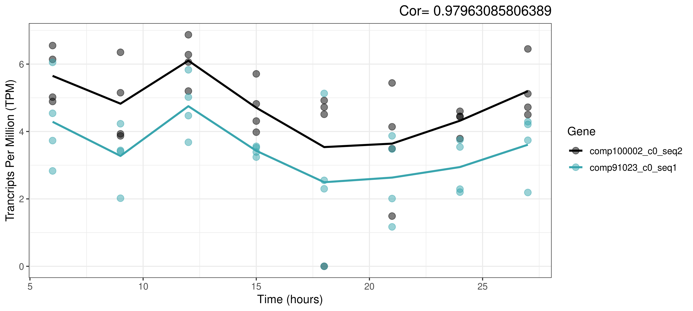

A Collection of Tools for Detecting Rhythmic Genes


# Overview
Allows analysis of rhythmic genes to be easily carried out on transcriptomics data using R. Designed to be as flexible as possible such as by allowing an unequal number of replicates across all time points. Where possible, functions have parallel alternatives in order to increase performance on multicore machines. Mundane tasks such as removing genes which show no activity can also be handled by CircadianTools.
# Install Guide 
From R:
```{r}
if (!requireNamespace("BiocManager", quietly = TRUE))
    install.packages("BiocManager")
BiocManager::install("rain")

install.packages("devtools")
devtools::install_github("nathansam/CircadianTools")
library(CircadianTools)
```
Documentation is available for CircadianTools and all of its functions via the usual help commands:
```
?CircadianTools
```

# Full List Of Functions
### General Tools
```basicplot```: Plots activity data as points and average activity as lines <br>
```compplot```: Plots two genes from a gene activity dataset <br>
```datasetplot```: Saves plots of all genes in a dataset. WARNING! Don't run on a large dataset! Intended for a filtered dataset <br>
#' 

### Clustering
```clusteroverview```: Plots the mean and error bars for all clusters across time <br>
```clusterplot```: Plots the mean and error bars for the genes in a cluster across time <br>
```clusterspread```: Shows how many genes are in each cluster after clustering has been applied. <br>
```clustertimeprofile```: Provides a dataframe of median values at each time point for each cluster. <br>
```clusters.to.text```: Takes a dataframe of clusters and stores the name of all genes in a text file. The row number deontes the cluster number. <br>
```hclustering```: Applies hierarchical clustering, clustering to a transcriptomics dataset and appends a cluster column to this dataset for all genes. <br>
```pamclustering```: Applies PAM (Partitioning around Medoids) clustering to a transcriptomics dataset and appends a cluster column to this dataset for all genes. <br>

### Correlation

```coranalysis```: Ranks correlation between a given gene and all other genes in a dataset. Plots both the given gene and highly correlated genes for a given correlation value <br>
```coranalysisdataset```: Correlates every gene in a dataset with every other gene in the same dataset. Allows a timelag between genes to be correlated. <br>
```coranalysiscluster```: Correlates the average activity of a cluster with the average activity of every other cluster. <br>
```coranalysisclusterdataset```: Correlates the average activity of each cluster with every other cluster in a dataset. <br>
```coranalysispar```: Parallel Implementation of ```coranalysis``` <br>
```corsignificantplot```: Prints or saves the genes found to be most significant by ```coranalysis``` or ```coranalysispar``` <br>

### Cosinor Functions

```cosinoranalysis```: Fits cosinor models to transcriptomics data and plots the best-fitting models using ggplot2. <br>
```cosinoranalysispar```: Parallel Implementation of ```cosinoranalysis```. <br>
```cosinorplot```: Fits a cosinor model to a given gene in a given dataset and plots the model. <br>
```cosinorsignificantplot```: Prints or saves the genes found to be most significant by ```cosinoranalysis```. <br>

### Filtering

```anovafilter```: Filters a gene activity dataframe via ANOVA. <br>
```combifilter```:  Filters a transcriptomics dataset by using ```zerofilter```, ```anovafilter``` and ```sizefilter```.<br>
```sizefilter```: Filters the genes with the smallest range from a transcriptomics dataset. <br>
```tfilter```: Experimental! Applies a filter where a t.test is carried out on gene activity levels between time points. <br>

```zerofilter```: Filters a transcriptomics dataset such that there is a minimum number of non-zero activity readings for each gene. <br>
### RAIN Functions

```rainanalysis```: Carries out RAIN analysis on a gene dataset. <br>
```rainsignificantplot``` Prints or saves the genes found to be most significant by ```rainanalysis```. <br>

### Turning Point Functions

```turningplot```: Fits a spline to a given gene in a given dataset. Finds the turning points. Plots the turning points and spline. <br>


### Utility Functions
```cytoscape.file```: Converts a correlation dataframe object into a format suitable for cytoscape and saves as a csv file. <br>
```file.conflict.R```: Checks if a file which will be created already exists and, if necessary asks the user if this file should be overwritten. <br>
```ggplot.cosinor.lm```: Adapted from the Cosinor package by Michael Sachs. Given a cosinor.lm model fit, generate a plot of the data with the fitted values. <br>
```generange```: Finds the range of gene activity for each gene in a dataframe. The median for the replicates is used for each time point. <br>
```genescale```: Centers/scales every gene in a transcriptomics dataset. <br>
```genesub```: Takes an object where the first column is genenames (IE a column of known Circadian genes) and subsets from a dataset containing activity for these genes. <br>
```maketimevector```: Produces a vector of time values for the gene activity readings. <br>
```geneclean```: Removes columns and rows which show no gene activity over time. <br>
```medlist```: Provides a dataframe of median values at each time point for each gene from a transcriptomics dataset. <br>
```tanalysis```: Experimental! A t.test is carried out on gene activity levels between time points and the number of significant increases & decreases is returned. <br>


# Examples

### Basic Plotting
```{r}
 basicplot("comp100001_c0_seq1",Laurasmappings)
```


### Cosinor Plotting
```{r}
cosinorplot("comp102333_c0_seq21", Laurasmappings)
```


### Turnpoint Plotting
```{r}
turningplot("comp101252_c0_seq2", Laurasmappings)
```
 

### Correlation Analysis
```{r}
coranalysis("comp100002_c0_seq2",Laurasmappings, print=TRUE, threshold=0.97, save=TRUE)
```
 


