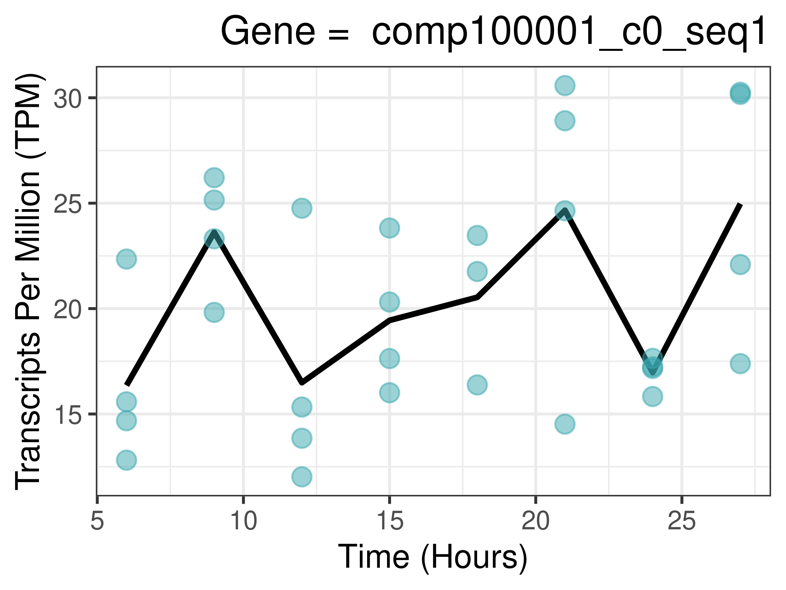
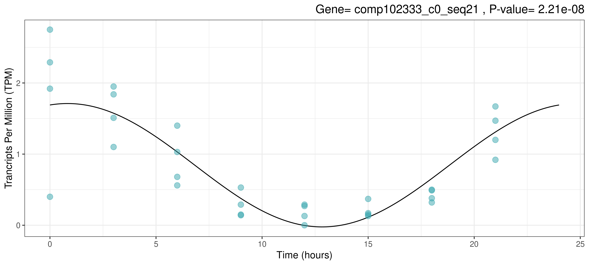
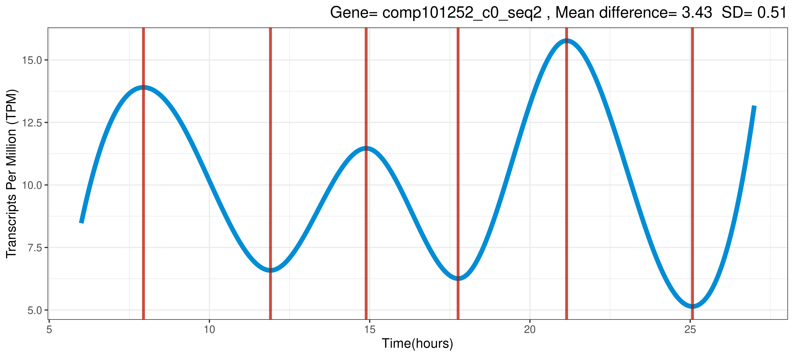

# CircadianTools
A Collection of Tools for Detecting Rhythmic Genes
## Overview
Allows Cosinor Models and Turning Point Analysis to be easily carried out on transcriptomics data using R. Designed to be as flexible as possible such as by allowing an unequal number of replicates.  
## Install Guide
From R:
```{r}
install.packages("devtools")
devtools::install_github("nathansam/CircadianTools")
```

## Basic Plotting
```{r}
 basicplot("comp100001_c0_seq1",Laurasmappings)
```


## Cosinor Plotting
```{r}
cosinorplot("comp102333_c0_seq21", Laurasmappings)
```



## Turnpoint Plotting
```{r}
turningplot("comp101252_c0_seq2", Laurasmappings)
```



