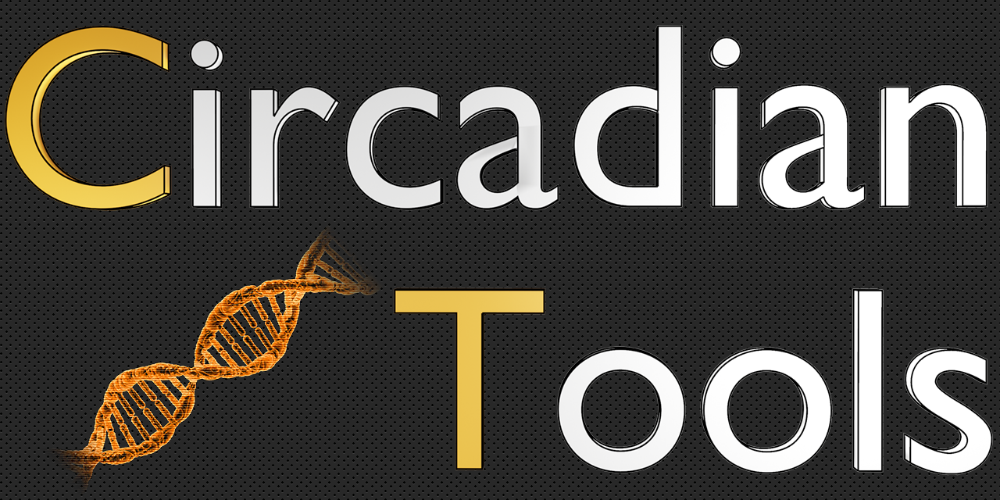

A Collection of Tools for Detecting Rhythmic Genes
## Overview
Allows cosinor analysis and turning Point techniques to be easily carried out on transcriptomics data using R. Designed to be as flexible as possible such as by allowing an unequal number of replicates across all time points. Mundane tasks such as removing genes which show no activity can also be handled by CircadianTools.
## Install Guide 
From R:
```{r}
install.packages("devtools")
devtools::install_github("nathansam/CircadianTools")
library(CircadianTools)
```
Documentation is available for CircadianTools and all of its functions via the usual help commands:
```
?CircadianTools
```


## Basic Plotting
```{r}
 basicplot("comp100001_c0_seq1",Laurasmappings)
```


## Cosinor Plotting
```{r}
cosinorplot("comp102333_c0_seq21", Laurasmappings)
```


## Turnpoint Plotting
```{r}
turningplot("comp101252_c0_seq2", Laurasmappings)
```
 


