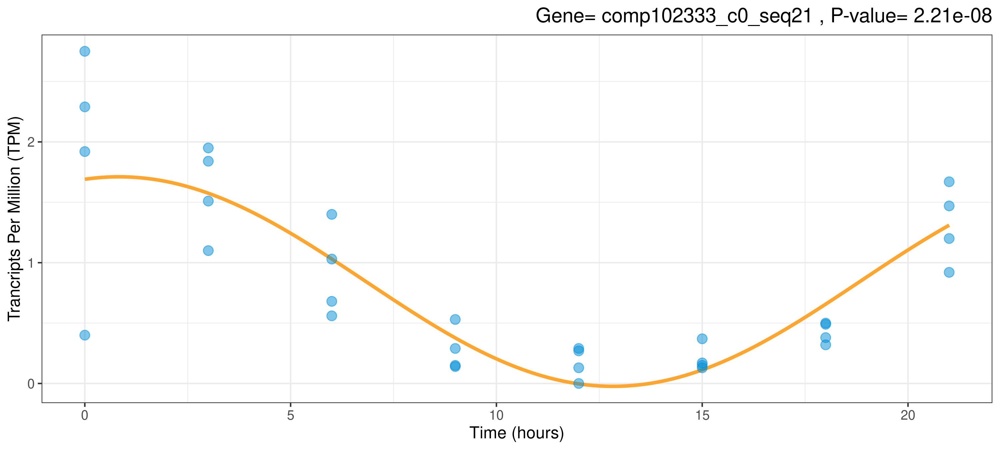

A Collection of Tools for Detecting Rhythmic Genes


# Overview
Allows analysis of rhythmic genes to be easily carried out on transcriptomics data using R. Designed to be as flexible as possible such as by allowing an unequal number of replicates across all time points. Where possible, functions have parallel alternatives in order to increase performance on multicore machines. Mundane tasks such as removing genes which show no activity can also be handled by CircadianTools.
# Install Guide 
From R:
```{r}
if (!requireNamespace("BiocManager", quietly = TRUE))
    install.packages("BiocManager")
BiocManager::install("rain")

install.packages("devtools")
devtools::install_github("nathansam/CircadianTools")
library(CircadianTools)
```
Documentation is available for CircadianTools and all of its functions via the usual help commands:
```
?CircadianTools
```

# Full List Of Functions
### General Tools
```basicplot```: Plots activity data as points and mean data as lines <br>
```anovafilter```: Filters a gene activity dataframe via ANOVA <br>
```compplot```: Plots two genes from a gene activity dataset <br>

### Correlation

```coranalysis```: Ranks correlation between a given gene and all other genes in a dataset. Plots both the given gene and highly correlated genes for a given correlation value <br>
```coranalysispar```: Parallel Implementation of ```coranalysis``` <br>
```corsignificantplot```: Prints or saves the genes found to be most significant by ```coranalysis``` or ```coranalysispar``` <br>

### Cosinor Functions

```cosinoranalysis```: Fits cosinor models to transcriptomics data and plots the best-fitting models using ggplot2. <br>
```cosinoranalysispar```: Parallel Implementation of ```cosinoranalysis``` <br>
```cosinorplot```: Fits a cosinor model to a given gene in a given dataset and plots the model. <br>
```cosinorsignificantplot```: Prints or saves the genes found to be most significant by ```cosinoranalysis``` <br>

### RAIN Functions

```rainanalysis```: Carries out RAIN analysis on a gene dataset  <br>
```rainsignificantplot``` Prints or saves the genes found to be most significant by ```rainanalysis``` <br>

### Turning Point Functions

```turningplot```: Fits a spline to a given gene in a given dataset. Finds the turning points. Plots the turning points and spline <br>


### Utility Functions

```ggplot.cosinor.lm```: Adapted from the Cosinor package by Michael Sachs. Given a cosinor.lm model fit, generate a plot of the data with the fitted values. <br>
```maketimevector```: Produces a vector of time values for the gene activity readings. <br>
```geneclean```: Removes columns and rows which show no gene activity over time. <br>


# Examples

### Basic Plotting
```{r}
 basicplot("comp100001_c0_seq1",Laurasmappings)
```


### Cosinor Plotting
```{r}
cosinorplot("comp102333_c0_seq21", Laurasmappings)
```



### Turnpoint Plotting
```{r}
turningplot("comp101252_c0_seq2", Laurasmappings)
```
 

### Correlation Analysis
```{r}
coranalysis(Laurasmappings, "comp100002_c0_seq2", print=TRUE, threshold=0.97, save=TRUE)
```
 


