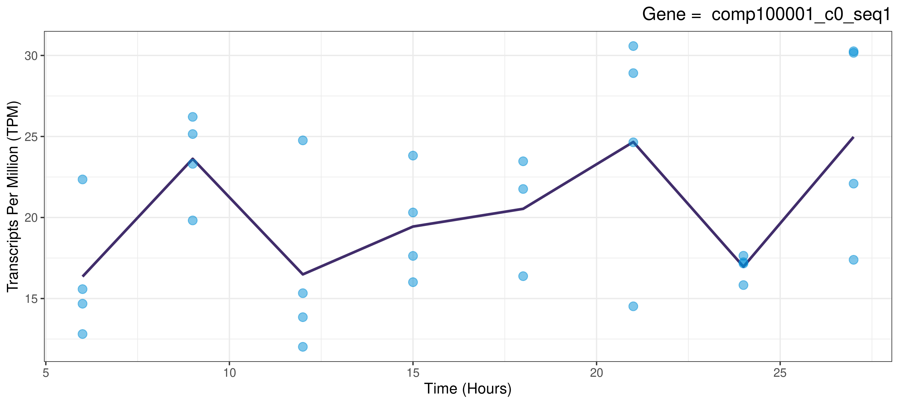

A Collection of Tools for Detecting Rhythmic Genes

  <!-- badges: start -->
  [](https://travis-ci.org/nathansam/CircadianTools)
  [](https://ci.appveyor.com/project/nathansam/CircadianTools)
  <!-- badges: end -->

# Overview
Allows analysis of rhythmic genes to be easily carried out on transcriptomics data using R. Designed to be as flexible as possible such as by allowing an unequal number of replicates across all time points. Where possible, functions have parallel alternatives in order to increase performance on multicore machines. Mundane tasks such as removing genes which show no activity can also be handled by CircadianTools.
# Install Guide 
From R:
```{r}
if (!requireNamespace("BiocManager", quietly = TRUE))
    install.packages("BiocManager")
BiocManager::install("rain", "seqinr")

install.packages("devtools")
devtools::install_github("nathansam/CircadianTools")
library(CircadianTools)
```
Documentation is available for CircadianTools and all of its functions via the usual help commands:
```
?CircadianTools
```

# Full List Of Functions

### Simple Plots

```BasicPlot```: Plots activity data as points and average activity as lines <br>
```CompPlot```: Plots two genes from a gene activity dataset <br>
```DatasetPlot```: Saves plots of all genes in a dataset. WARNING! Don't run on a large dataset! Intended for a filtered dataset <br>
```TurningPlot```: Fits a spline to a given gene in a given dataset. Finds the turning points. Plots the turning points and spline. <br>

### Clustering

```ClusterCenterGenerator```: Finds the center of every cluster in a dataset <br>
```ClusterCorDatasetPlot```: Uses ```ClusterCorPlot``` to plot all of the clusters generated by a clustering method when absolute Pearson's correlation was used as a distance measure. <br>
```ClusterCorPlot```: Plots the activity level for a cluster generated by using absolute Pearson's correlation as a distance measure. Plots positively and negatively correlated genes as two different lines. <br>
```ClusterDatasetPlot```: Plots the mean and error bars for all clusters across time <br>
```ClusterParamSelection```: Calculates validation metrics for different clustering methods and different numbers of partitions. The validation metrics are plotted. <br>
```ClusterPlot```: Plots the mean and error bars for the genes in a cluster across time <br>
```ClusterSpread```: Shows how many genes are in each cluster after clustering has been applied. <br>
```ClusterText```: Takes a dataframe of clusters and stores the name of all genes in a text file. The row number deontes the cluster number. <br>
```ClusterTimeProfile```: Provides a dataframe of median values at each time point for each cluster. <br>
```CommonSingletonFinder```: Finds the genes which belong to common singleton clusters in two different clustered datasets. <br>
```DendogramDatasetPlot```: Plots the dendogram for every cluster in a clustered dataset. <br>
```DendogramPlot```: Plots the dendogram for a cluster in a clustered dataset <br>
```DianaClustering```: Applies Diana (DIvisive ANAlysis) clustering to a transcriptomics dataset and appends a cluster column to this dataset for all genes. <br>
```DianaParamSelection```:  Runs DIANA (DIvisive ANAlysis) clustering with differing numbers of partitions and returns validation metrics. <br>
```FindClusterDistanceQuantiles```: Finds The distances between the center of each cluster and the centers of all the other clusters. <br>
```FindClusterMedian```: Finds the center of a cluster <br>
```FindClusterQuantile```: Finds The distances between the center of a cluster and the centers of all other clusters. <br>
```HClustering```: Applies hierarchical clustering, clustering to a transcriptomics dataset and appends a cluster column to this dataset for all genes. <br>
```HclustParamSelection```: Runs hierarchical clustering with differing numbers of partitions and returns validation metrics. <br>
```MDSPlot```: Applies multidimensional scaling to a clustered transcriptomics dataset to reduce the clusters to two dimensions and then plots the clusters.  <br>
```PamClustering```: Applies PAM (Partitioning around Medoids) clustering to a transcriptomics dataset and appends a cluster column to this dataset for all genes. <br>
```PamParamSelection```: Runs PAM with differing numbers of partitions and returns validation metrics. <br>
```QuantilePlots```: Finds the quartiles for intercluster distances and plots these distances as a set of histograms <br>
```SingletonNameFinder```: Finds the genes which belong to singleton clusters. <br>
  
### Correlation

```CorAnalysis```: Ranks correlation between a given gene and all other genes in a dataset. Plots both the given gene and highly correlated genes for a given correlation value <br>
```CoranalysisCluster```: Correlates the average activity of a cluster with the average activity of every other cluster. <br>
```CoranalysisClusterDataset```: Correlates the average activity of each cluster with every other cluster in a dataset. <br>
```CorAnalysisDataset```: Correlates every gene in a dataset with every other gene in the same dataset. Allows a timelag between genes to be correlated. <br>
```CorAnalysisPar```: Parallel Implementation of ```CorAnalysis``` <br>
```CorSignificantPlot```: Prints or saves the genes found to be most significant by ```CorAnalysis``` or ```CorAnalysisPar``` <br>

### Cosinor

```CosinorAnalysis```: Fits cosinor models to transcriptomics data and plots the best-fitting models using ggplot2. <br>
```CosinorAnalysisPar```: Parallel Implementation of ```CosinorAnalysis```. <br>
```CosinorPlot```: Fits a cosinor model to a given gene in a given dataset and plots the model. <br>
```CosinorResidualDatasetPlot```: Fits a cosinor model and plot the residuals for multiple genes in a dataset <br>
```CosinorResidualPlot```: Fits a cosinor model to a gene and plots the residuals <br>
```CosinorSignificantPlot```: Prints or saves the genes found to be most significant by ```CosinorAnalysis```. <br>
```MultiCosinorTest```: Fits a cosinor model and carries out ANOVA using raw coefficients. Then fits a cosinor model with additonal sine and cosine terms with a different period. ANOVA tests are carried out on the  more complex model as well as directly comparing the two models. <br>

### Cytoscape

```CytoscapeFile```: Converts a correlation dataframe object into a format suitable for cytoscape and saves as a csv file. <br>
```CytoscapeFilter```: Reduces the size of a file intended for Cytoscape by filtering out the genes/clusters which are not correlated <br>

### Fasta Files

```ContigGen```: Finds all unique contig IDs in a transcriptomics dataset <br>
```FastaSub```: Creates a fasta file from only certain sequences in another fasta file <br>


### Filtering

```AnovaFilter```: Filters a gene activity dataframe via ANOVA. <br>
```CombiFilter```:  Filters a transcriptomics dataset by using ```ZeroFilter```, ```AnovaFilter``` and ```SizeFilter```.<br>
```SizeFilter```: Filters the genes with the smallest range from a transcriptomics dataset. <br>
```TFilter```: Applies a filter where a t-test is carried out on gene activity levels between time points. <br>

```ZeroFilter```: Filters a transcriptomics dataset such that there is a minimum number of non-zero activity readings for each gene in the resultant dataset. <br>

### RAIN

```RainAnalysis```: Carries out RAIN analysis on a transcriptomics dataset. <br>
```RainSignificantPlot``` Prints or saves the plots of genes found to be most significant by ```RainAnalysis```. <br>

### Utility Functions

```AbsCorDist```: Calculates a distance matrix based on the distance measure of: 1 - |cor(x, y)| <br>
```ActivitySelect```: Returns gene activity by either gene name or row number <br>
```FileConflict```: Checks if a file which will be created already exists and, if necessary asks the user if this file should be overwritten. <br>
```ggplot.cosinor.lm```: Adapted from the Cosinor package by Michael Sachs. Given a cosinor.lm model fit, generate a plot of the data with the fitted values. <br>
```GeneRange```: Finds the range of gene activity for each gene in a dataframe. The median for the replicates is used for each time point. <br>
```GeneScale```: Centers/scales every gene in a transcriptomics dataset. <br>
```GeneSub```: Takes an object where the first column is genenames (IE a column of known Circadian genes) and subsets from a dataset containing activity for these genes. <br>
```MakeTimevector```: Produces a vector of time values for the gene activity readings. <br>
```GeneClean```: Removes columns and rows which show no gene activity over time. <br>
```MedList```: Provides a dataframe of median values at each time point for each gene from a transcriptomics dataset. <br>
```TAnalysis```: Experimental! A t.test is carried out on gene activity levels between time points and the number of significant increases & decreases is returned. <br>


# Examples

### Basic Plotting
```{r}
 BasicPlot("comp100001_c0_seq1",Laurasmappings)
```


### Cosinor Plotting
```{r}
CosinorPlot("comp102333_c0_seq21", Laurasmappings)
```


### Turnpoint Plotting
```{r}
TurningPlot("comp101252_c0_seq2", Laurasmappings)
```
 

### Correlation Analysis
```{r}
CorAnalysis("comp100002_c0_seq2",Laurasmappings, print=TRUE, threshold=0.97, save=TRUE)
```
 


